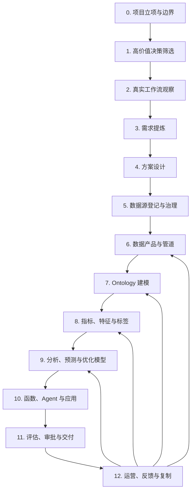
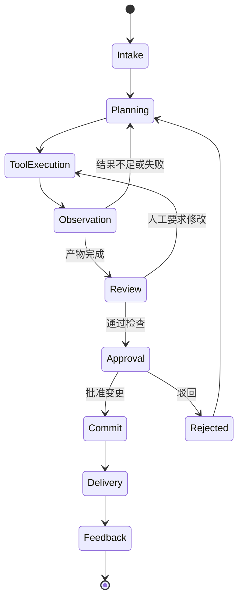

# AI FDE 工程结构复刻项目：需求与系统设计

**文档状态：** 已确认方向，进入实现计划前的设计基线
**版本：** 0.1
**日期：** 2026-08-10
**适用范围：** 本地/私有资料与 Git 优先的自用 MVP
**研究对象：** Palantir Foundry / Ontology / AIP / AI FDE 的公开工程方法，不复刻其未公开的内部实现

## 0. 执行摘要

本项目要构建一套面向 FDE（Forward Deployed Engineer，前线部署工程师）工作的 AI 工程代理系统。它的目标不是生成一个聊天机器人，也不是把业务资料简单放进向量库，而是把一条可审查、可运行、可回滚的业务 AI 工程链路标准化：

```text
散乱资料与业务目标
→ 决策用例提炼
→ 真实工作流建模
→ 解决方案设计
→ 数据源登记与数据契约
→ 数据管道与数据产品
→ Ontology 草案与校验
→ 指标、特征、分析、预测、优化模型
→ 函数、规则、Agent 与应用骨架
→ 测试、评估、人工审批
→ Git 交付、部署与运行反馈
```

第一版选择“本地/私有资料与 Git 优先”作为明确边界，先解决 FDE 最费人工、最可复用、最适合自动化的工程工作：资料盘点、需求提炼、模型草拟、代码/配置生成、质量验证、证据追踪和交付打包。企业数据库、文档库、消息系统和 ERP 的连接器作为第二阶段适配器，不阻塞 MVP 的核心闭环。

### 0.1 核心判断

用户过去使用 RDFS 对对象、属性、链接和状态进行描述，得到的是“业务世界的语义镜像”。它可以回答“有什么、如何关联、当前处于什么状态”，但不会自动产生“未来会发生什么”和“现在应该做什么”的能力。

本项目必须把以下四类模型分开，再通过 Ontology 统一连接：

| 模型 | 主要问题 | 运行引擎 | Ontology 中的承载内容 |
|---|---|---|---|
| 描述模型 | 世界中有哪些对象和关系 | RDFS / OWL | 类、属性、链接、状态、权限 |
| 分析模型 | 发生了什么、为什么发生 | SQL、Python、Spark、统计引擎 | 指标、切片、聚合、观察结果 |
| 预测模型 | 将来可能发生什么 | scikit-learn、XGBoost、PyTorch 等 | 特征、标签、模型版本、预测结果 |
| 决策/优化模型 | 应该采取什么动作 | 规则引擎、OR-Tools、Pyomo、CVXPY、Gurobi 等 | 决策变量、目标、约束、方案、动作 |

RDFS 可以描述这四类模型的元数据和语义接口，但不能替代 SQL、机器学习训练器或优化求解器。推荐使用 RDFS/OWL + SHACL + PROV-O/时间语义 + 外部计算引擎的分层架构。

## 1. 背景与问题定义

### 1.1 当前问题

传统 Ontology 项目常见的路径是：

```text
盘点业务对象
→ 建立对象和关系
→ 接入一个大模型
→ 做问答或聊天界面
```

这条路径容易产生以下结果：

- Ontology 是业务流程的静态镜像；
- 数据没有统一主键、粒度、时间语义和质量契约；
- 关系没有被转成可计算特征；
- 没有明确的预测时点、预测窗口和标签；
- 模型输出没有进入决策阈值和业务动作；
- 用户动作和真实结果没有回写；
- 项目交付的是一个演示应用，而不是可运营产品。

### 1.2 目标问题

本项目要解决的具体问题是：

> 给定一个业务领域、一组散乱资料和一个需要改善的决策，AI FDE 能否在人工审批下，快速形成完整的工程骨架，并为每个结论、字段、对象、管道和模型提供来源与验证证据？

### 1.3 典型示例：供应商延误预警

MVP 以“供应商交付延误预警与处置建议”作为贯穿式参考用例，但项目内核不能写死在供应链领域。

目标决策契约：

```text
采购经理在供应商风险工作台中，
基于截至观察时点可获得的订单、供应商历史表现、物流事件、库存和生产需求，
判断某个未完成订单在未来 7 天内延误超过 3 天的风险，
并选择催交、加急运输、改派供应商、调整库存或升级审批。
```

预测问题：

```text
entity = PurchaseOrder
as_of_time = 预测时点
horizon = 未来 7 天
target = 实际交付日 > 承诺交付日 + 3 天
output = delay_probability, expected_delay_days, risk_level, reason_codes
```

决策问题：

```text
objective = 最小化延误损失 + 加急成本 + 切换成本 + 库存成本
variables = 是否催交、是否加急、是否改派、是否调整库存
constraints = 预算、产能、合同、物料兼容性、生产线能力、审批权限
```

## 2. 产品目标与非目标

### 2.1 产品目标

#### G1：将 FDE 工作拆成可编排的工程阶段

每个阶段必须具有明确的输入、输出、工具、状态、证据、验证和人工审批点。

#### G2：把自然语言需求转成结构化工程产物

至少支持生成和维护：

- 用例章程；
- 用户—界面—决策—输入—动作需求；
- 工作流和生命周期图；
- 对象/关系/状态/动作模型；
- 数据源登记表；
- 数据产品契约；
- SHACL 验证规则；
- SQL/Python 管道骨架；
- 指标与特征定义；
- 预测/优化模型接口；
- 函数和 Agent 工具契约；
- 应用页面与 API 骨架；
- 测试用例、评估集和交付清单。

#### G3：让每个产物可追溯、可审查、可回滚

任何 Agent 生成或修改的结果，都必须能回答：

```text
是谁生成的？
基于哪些资料？
使用了哪些工具？
修改了哪些文件？
通过了哪些检查？
谁批准了？
如何回滚？
```

#### G4：降低 FDE 的重复劳动

第一版优先自动化：

- 资料分类和内容索引；
- 术语、对象、字段和关系候选识别；
- 需求模板填充；
- 数据源盘点和字段分析；
- 数据契约与验证规则草拟；
- 管道和测试样板生成；
- 特征定义和数据泄漏初检；
- Ontology 草案生成；
- 代码检查、运行预览和失败诊断；
- 交付包和证据报告生成。

#### G5：为预测与决策提供真正的工程接口

系统不能只生成静态 Ontology。必须能够表达：

- 历史事件和时间快照；
- 指标和分析结果；
- 特征计算函数；
- 标签和预测窗口；
- 模型版本和评估；
- 决策变量、目标和约束；
- 推荐方案和可执行动作；
- 用户覆盖、动作结果和反馈。

### 2.2 非目标

MVP 不承诺：

- 复刻 Palantir Foundry 的完整平台或用户界面；
- 直接获得 Palantir 的内部代码、模型或专有实现；
- 自动连接所有企业系统；
- 无审批修改生产数据或执行高风险业务动作；
- 让 LLM 代替领域专家决定业务本体；
- 在没有历史标签的情况下伪造预测能力；
- 把任意文档自动合并为唯一真相；
- 在没有评估证据的情况下自动发布模型或 Agent。

## 3. 设计原则

### P1：业务决策优先

项目从“哪个决策需要改善”开始，不从“有多少数据”或“使用什么大模型”开始。

### P2：数据产品先于预测模型

数据必须先具备稳定粒度、主键、时间语义、质量规则、血缘、刷新策略和权限，模型才能被评估和运营。

### P3：Ontology 是运营语义层

Ontology 不是源表目录，也不是所有计算的替代物。它负责把数据、业务语义、规则、模型、动作和权限放在同一业务上下文中。

### P4：描述、计算、执行分离

```text
描述：RDFS / OWL
校验：SHACL
血缘和时间：PROV-O / 时间语义
计算：SQL / Python / ML / Optimization
执行：API / Function / Workflow / Action
```

### P5：AI 先建议，再执行

只读分析、草案生成和测试可以高度自动化。写入、合并、部署、外部系统调用和业务动作必须有明确的审批边界。

### P6：每个结论必须有证据

AI 生成的字段、关系、公式、模型假设和建议必须链接到原始文件、页面、数据字段、代码运行或人工确认。

### P7：每个动作必须产生反馈

没有动作结果就无法判断预测是否有价值，也无法优化阈值、策略和用户体验。

### P8：失败必须可见、可重试、可回放

禁止静默丢失文档、字段、记录、模型运行或 Agent 工具调用。

## 4. 目标用户与责任角色

| 角色 | 目标 | 主要权限 |
|---|---|---|
| 领域负责人 | 对业务价值和范围负责 | 批准用例和业务目标 |
| 用例负责人 | 推动跨部门落地 | 推进阶段、协调资源、管理采用 |
| 领域 SME | 定义业务语义和例外 | 确认对象、指标、规则和动作 |
| FDE/项目工程师 | 设计和交付端到端方案 | 生成、修改、测试和打包工程产物 |
| 数据工程师 | 建立可信数据产品 | 管道、质量、增量和血缘 |
| Ontology 工程师 | 建立业务语义与动作层 | 对象、关系、状态、函数和权限 |
| 数据科学/ML 工程师 | 建立可评估模型 | 特征、标签、训练、评估和部署 |
| 应用工程师 | 嵌入用户工作流 | 页面、API、审批和操作体验 |
| 安全/治理负责人 | 控制风险和权限 | 数据分类、访问、审计和发布门槛 |
| AI FDE 系统管理员 | 管理代理、工具和策略 | 工具白名单、模型配置、运行策略 |
| 审批人 | 对变更或动作做最终确认 | 合并、发布或执行高风险操作 |

### 4.1 责任分配原则

Agent 可以提出候选方案，但不能成为业务语义的唯一 Owner。领域 SME 负责“这是什么意思”，数据工程师负责“如何稳定计算”，模型工程师负责“是否有预测证据”，业务负责人负责“是否值得投入和采用”。

## 5. 端到端工程生命周期



### 5.1 阶段通用模板

每个阶段的 Agent 运行必须生成一个 `StageRun`：

```yaml
stage_run:
  run_id: "run-uuid"
  project_id: "project-id"
  stage_id: "requirements.distill"
  actor: "agent-or-human-id"
  input_artifacts: []
  tool_calls: []
  output_artifacts: []
  evidence_refs: []
  validation_results: []
  approval_state: "draft|needs_review|approved|rejected|blocked"
  branch: "feature/run-uuid"
  parent_run_id: null
  started_at: "timestamp"
  completed_at: null
  failure: null
```

阶段只有在以下条件同时满足时才能进入下一阶段：

1. 必需产物存在；
2. 结构校验通过；
3. 必需证据已关联；
4. 失败项已处理或被明确豁免；
5. 需要人工批准的内容已批准。

## 6. MVP 业务流程与阶段需求

### 6.1 阶段 0：立项和边界

#### 目标

把“建设 AI 能力”变成可测量的业务用例。

#### 输入

- 业务目标和损失描述；
- 当前流程和已有系统；
- 目标用户；
- 可用资料目录；
- 组织、权限和合规限制。

#### Agent 工作

1. 创建项目空间和 Git 分支；
2. 扫描资料目录但不默认读取受限内容；
3. 提取业务目标、用户、决策和候选 KPI；
4. 识别范围外问题；
5. 生成用例章程草案；
6. 生成风险和依赖清单；
7. 请求领域负责人确认。

#### 产物

- `project_charter.md`；
- `scope.yaml`；
- `stakeholder_matrix.yaml`；
- `value_hypothesis.yaml`；
- `risk_register.yaml`。

#### 验收

- 至少写出一名具体用户；
- 至少写出一个具体决策；
- 至少写出一个可观察业务结果；
- 至少存在一名业务 Owner；
- 范围外事项明确。

### 6.2 阶段 1：高价值决策筛选

#### 需求

系统必须支持对候选决策进行评分和比较：

```yaml
decision_candidate:
  name: "供应商延误处置"
  user: "采购经理"
  decision_frequency: "daily"
  decision_latency: "hours"
  error_cost: 5
  data_availability: 3
  adoption_feasibility: 4
  reuse_potential: 5
  governance_risk: 3
  score: null
```

#### Agent 工作

- 从访谈纪要、流程文档和历史项目中提取候选决策；
- 识别“等待、判断、批准、分配、排程、升级”等高价值动词；
- 把候选决策映射到用户、输入、动作和结果；
- 计算可配置优先级分；
- 生成待访谈问题。

#### 验收

- 不允许只以技术可行性作为排序依据；
- 每个候选决策必须有损失或收益假设；
- 每个候选决策必须有明确的结果观测方式。

### 6.3 阶段 2：真实工作流观察

#### 需求

系统必须支持把访谈、会议纪要、屏幕操作记录、表格、邮件和流程文档归档成带证据的工作流事实。

#### Agent 工作

1. 为最近一次真实事件建立 `WorkflowObservation`；
2. 区分用户看到的输入、用户实际使用的输入和用户口头描述的输入；
3. 记录跨系统切换、复制粘贴、人工计算、咨询对象和例外路径；
4. 将“经验判断”转成候选规则或待验证假设；
5. 将所有事实关联到原始证据位置；
6. 标记客户确认项，不把推断写成事实。

#### 产物

- 当前状态流程图；
- 决策点清单；
- 输入字段清单；
- 动作和审批清单；
- 例外清单；
- 术语表；
- 待确认问题清单。

#### 验收

- 每个关键决策点至少包含一名实际执行者；
- 每个输入都区分来源、可信度和使用方式；
- 每个动作都说明是否改变外部系统；
- 例外路径不能被主流程吞掉。

### 6.4 阶段 3：需求提炼

#### 规范格式

所有功能需求使用以下格式：

```text
[用户类型] 在 [界面/工作位置]
基于 [决策输入]
做出 [判断/选择]
并执行 [动作]
产生 [业务结果]
```

#### 示例

```text
采购经理在供应商风险收件箱中，
基于订单承诺日、供应商历史表现、运输事件、库存和生产需求，
判断某采购订单未来七天内延误超过三天的风险，
并选择催交、加急运输、改派供应商、调整库存或升级审批，
产生延误损失下降和人工核查时间下降的结果。
```

#### 需求实体

```yaml
functional_requirement:
  requirement_id: "FR-001"
  actor_type: "ProcurementManager"
  interface: "SupplierRiskInbox"
  decision: "是否采取延误缓解动作"
  decision_inputs:
    - "PurchaseOrder.promised_delivery_date"
    - "Supplier.supplier_delay_rate_90d"
    - "Shipment.last_event_age_hours"
    - "Inventory.projected_shortage_days"
  action_options:
    - "RequestExpedite"
    - "ReassignSupplier"
    - "AdjustInventory"
    - "EscalateApproval"
  outcome_metrics:
    - "avoidable_delay_loss"
    - "user_decision_latency"
  evidence_refs: []
```

### 6.5 阶段 4：方案设计

#### 需求

系统必须把功能需求映射成以下设计视图：

1. 对象模型；
2. 生命周期模型；
3. 数据丰富化清单；
4. 界面和动作期望；
5. 权限边界；
6. 模型与函数依赖；
7. 反馈字段。

Palantir 官方方案设计文档将功能需求映射到对象类型、链接类型、生命周期、数据丰富化和界面期望；本项目将这一方法抽象为可版本化设计产物。[Palantir 方案设计](https://www.palantir.com/docs/zh/foundry/use-case-life-cycle/solution-design)

#### 产物

- `solution_design.md`；
- `object_model.yaml`；
- `lifecycle.yaml`；
- `data_enrichment.yaml`；
- `interface_expectations.yaml`；
- `permission_matrix.yaml`；
- `decision_contract.yaml`。

### 6.6 阶段 5：数据源登记与治理

#### 数据源登记结构

```yaml
source_asset:
  source_id: "erp.purchase_orders"
  source_type: "csv|excel|json|parquet|sql|api|document|media"
  owner: "ProcurementDataOwner"
  technical_contact: "DataPlatformOwner"
  classification: "internal|confidential|restricted"
  business_purpose: "采购订单事实"
  grain: "one row per purchase order line"
  primary_key: ["po_id", "po_line_id"]
  event_time_fields: ["created_at", "promised_delivery_date"]
  observed_time_field: "ingested_at"
  refresh: "daily"
  history: "24 months"
  known_issues: []
  access_policy: "procurement-read"
  evidence_refs: []
```

#### Agent 工作

- 读取目录、文件头、表结构和样例数据；
- 生成字段画像、缺失率、唯一性、类型和时间分布；
- 识别候选主键和外键；
- 发现同义字段和冲突字段；
- 建立来源—字段—对象的候选映射；
- 生成需要客户确认的问题；
- 不自动合并冲突数据。

### 6.7 阶段 6：数据产品与管道

#### 数据产品契约

```yaml
data_product:
  product_id: "supplier_delivery_events"
  purpose: "支持供应商交付状态分析与延误预测"
  output_location: "data_products/supplier_delivery_events"
  grain: "one row per delivery event"
  primary_key: ["event_id"]
  business_keys: ["po_id", "shipment_id", "supplier_id"]
  fields:
    - name: "event_type"
      type: "enum"
      allowed_values: ["confirmed", "shipped", "in_transit", "arrived", "received"]
      nullable: false
    - name: "event_time"
      type: "timestamp"
      nullable: false
    - name: "observed_time"
      type: "timestamp"
      nullable: false
  freshness:
    max_lag: "24h"
  quality:
    expectations:
      - "event_id is unique"
      - "event_time is not null"
      - "event_time <= observed_time + allowed_late_arrival"
      - "po_id resolves to a purchase order"
  lineage:
    sources: ["erp.purchase_orders", "tms.shipment_events", "wms.receipts"]
  access_policy: "supply-chain-analytics"
  downstream: ["ontology.PurchaseOrder", "feature.delay_risk", "model.delay_v2"]
  owner: "SupplyChainDataProductOwner"
  version: "0.1.0"
```

#### 管道分层

```text
raw：原始文件/原始表/原始事件，尽量保留原貌
staged：解析、类型化、标准化后的中间层
conformed：主键、时间、枚举和跨源实体统一后的事实层
enriched：指标、特征、标签和衍生事件层
ontology_projection：映射到业务对象、关系、状态和动作输入
serving：面向应用、模型、搜索和 Agent 的服务层
```

#### 散乱文档处理


文档抽取的核心要求：

- 原文不可变保存；
- 每条结构化记录保留文件、页码、段落、表格单元格或 bounding box；
- 提取结果必须区分事实、推断、缺失和冲突；
- 文档重复、版本覆盖和字段冲突必须进入待确认队列；
- 新文档走增量处理；
- 规则或 Prompt 变化必须支持批量重跑；
- 失败文件可单独重试；
- 下游对象能追溯到原始证据。

Palantir 公开的 Document Intelligence 文档展示了原始文本/OCR、布局感知解析、VLM 抽取、质量/速度评估、证据定位以及将验证后的策略部署为 Python transform 的思路。本项目把这些能力实现为可替换的文档抽取适配器，而不是依赖某一平台的专有接口。[Document Intelligence 概览](https://www.palantir.com/docs/foundry/document-intelligence/overview) ｜ [部署到 Python transforms](https://www.palantir.com/docs/foundry/document-intelligence/deploy-to-python-transforms)

### 6.8 阶段 7：Ontology 建模

#### 业务语义元模型

```text
Project
 ├── DecisionUseCase
 ├── Actor
 ├── Interface
 ├── ObjectType
 │    ├── CoreObjectType
 │    ├── EventObjectType
 │    ├── DerivedObjectType
 │    ├── RiskObjectType
 │    └── WorkflowObjectType
 ├── PropertyDefinition
 ├── LinkType
 ├── StateDefinition
 ├── ActionType
 ├── FunctionDefinition
 ├── MetricDefinition
 ├── FeatureDefinition
 ├── PredictionModel
 ├── OptimizationModel
 ├── Evidence
 └── PermissionPolicy
```

#### RDFS/OWL/SHACL 责任边界

| 需求 | 推荐技术 | 说明 |
|---|---|---|
| 类、子类、属性、domain、range | RDFS | 业务概念和基本语义 |
| 复杂类限制、等价类、推理 | OWL | 仅用于稳定且确有价值的语义推理 |
| 字段必填、类型、枚举、基数、范围 | SHACL | 数据和模型输入验证 |
| 时间和有效期 | OWL-Time 或显式时间字段 | 区分 event、valid、observed、as-of time |
| 数据来源和处理过程 | PROV-O 或自定义血缘模型 | 记录实体、活动和代理 |
| SQL、ML、优化计算 | 外部引擎 | RDFS 只描述接口和元数据 |
| 改变业务状态 | Action / API / Workflow | 必须有权限、审批和审计 |

W3C 文档说明 RDFS 提供 RDF 数据建模词汇，而 SHACL 用于 RDF 图约束验证；OWL 提供比 RDFS 更丰富的本体表达能力；PROV-O 用于表达数据和活动的来源关系。[RDFS](https://www.w3.org/TR/rdf-schema/) ｜ [SHACL](https://www.w3.org/TR/shacl/) ｜ [OWL 2](https://www.w3.org/TR/owl2-overview/) ｜ [PROV-O](https://www.w3.org/TR/prov-o/)

#### Ontology 对象最小字段

```yaml
object_type:
  object_type_id: "PurchaseOrder"
  label: "采购订单"
  description: "采购组织向供应商发出的采购承诺"
  superclass: "BusinessTransaction"
  primary_key: ["po_id"]
  properties: []
  links: []
  states: []
  actions: []
  permissions: []
  source_mappings: []
  evidence_refs: []
  owner: "ProcurementDomainOwner"
  version: "0.1.0"
```

#### 建模顺序

1. 先建稳定的核心对象和事件；
2. 再建关系、状态和权限；
3. 再接入数据产品；
4. 再定义指标、特征、标签和预测；
5. 再定义决策变量、约束、推荐方案；
6. 最后定义动作、函数、应用和 Agent 接口。

### 6.9 阶段 8：指标、特征和标签

#### FeatureDefinition

特征不是静态属性，而是一个带有粒度、时间截面、窗口、公式和版本的可计算函数。

```yaml
feature_definition:
  feature_id: "supplier_delay_rate_90d"
  entity_type: "Supplier"
  grain: "supplier_id x as_of_time"
  value_type: "float"
  formula: "delayed_completed_orders_90d / completed_orders_90d"
  source_products: ["purchase_order_history", "delivery_events"]
  event_time: "delivery_completed_at"
  as_of_time: "prediction_as_of_time"
  observation_window: "90d"
  availability_lag: "24h"
  freshness_slo: "24h"
  null_policy: "return_null_with_reason"
  leakage_policy: "reject_data_after_as_of_time"
  serving_mode: "batch"
  version: "1.0.0"
  owner: "SupplyChainMLOwner"
  evidence_refs: []
```

#### 特征抽象指令

Agent 必须依次回答：

1. 特征属于哪个业务实体？
2. 一行特征代表什么粒度？
3. 在哪个观察时间点可获得？
4. 计算使用哪段历史窗口？
5. 需要哪些事件和字段？
6. 如何处理迟到事件和缺失？
7. 如何保证不能使用未来信息？
8. 多久刷新一次？
9. 如何评估稳定性和漂移？
10. 是否可被批量训练、在线查询和回放？

#### 标签定义

```yaml
label_definition:
  label_id: "late_over_3d_within_7d"
  entity_type: "PurchaseOrder"
  prediction_horizon: "7d"
  outcome_rule: "actual_delivery_at > promised_delivery_at + 3d"
  label_available_after: "actual_delivery_at + allowed_late_arrival"
  exclusions:
    - "cancelled_by_buyer"
    - "manual_date_change_without_original_commitment"
  partial_delivery_policy: "label_by_first_complete_receipt"
  version: "1.0.0"
```

### 6.10 阶段 9：分析、预测和优化模型

#### 分析模型契约

```yaml
analysis_model:
  analysis_id: "supplier_performance_monthly"
  entity: "Supplier"
  grain: "supplier_id x month"
  measures:
    - "order_count"
    - "on_time_rate"
    - "delay_p95_days"
  dimensions:
    - "material_category"
    - "factory"
    - "transport_mode"
  time_semantics: "event_time"
  output_product: "supplier_performance_history"
  validation: ["metric_reconciliation", "period_completeness"]
```

#### 预测模型契约

```yaml
prediction_model:
  model_id: "supplier_delay_v2"
  problem_id: "late_over_3d_within_7d"
  input_entity: "PurchaseOrder"
  feature_set: "delay_features_v1"
  output:
    - "delay_probability"
    - "expected_delay_days"
    - "reason_codes"
  evaluation:
    split: "time_based"
    metrics: ["PR_AUC", "recall_at_review_capacity", "calibration", "lead_time"]
  decision_policy: "delay_risk_policy_v1"
  deployment: "batch_daily"
  feedback: "mitigation_outcome_events"
```

#### 决策/优化模型契约

```yaml
decision_model:
  decision_id: "supplier_delay_mitigation"
  input_objects:
    - "PurchaseOrder"
    - "Supplier"
    - "InventoryPosition"
    - "ProductionRequirement"
    - "DelayPrediction"
  variables:
    - name: "expedite"
      domain: "boolean"
    - name: "reassign_supplier"
      domain: "boolean"
    - name: "inventory_adjustment"
      domain: "non_negative_integer"
  objectives:
    - "minimize_total_expected_cost"
  constraints:
    - "budget_limit"
    - "supplier_capacity"
    - "material_compatibility"
    - "approval_limit"
  outputs:
    - "CandidateMitigationPlan"
    - "Recommendation"
  execution:
    action_types: ["RequestExpedite", "ReassignSupplier", "AdjustInventory", "EscalateApproval"]
    approval_required: true
```

#### 分层执行原则

```text
Ontology：语义、输入、输出、权限和证据
SQL/Python：指标和特征计算
ML runtime：预测
Solver/rule engine：方案求解
Function/API：统一调用接口
Action/workflow：状态变化和业务执行
```

### 6.11 阶段 10：函数、规则、LLM 和 Agent

#### 统一工具契约

每个工具必须有机器可读的定义：

```yaml
tool:
  tool_id: "preview_data_product"
  description: "在不写入生产的情况下预览数据产品输出"
  input_schema: {}
  output_schema: {}
  required_scopes: ["data.read", "run.preview"]
  side_effect_level: "none"
  timeout_seconds: 120
  retry_policy: "idempotent_transient_only"
  evidence_output: true
  audit_fields: ["run_id", "actor", "inputs", "result_hash"]
```

#### 工具风险等级

| 等级 | 示例 | 默认策略 |
|---|---|---|
| L0 | 读取目录、读取 schema、搜索资料 | Agent 可直接调用 |
| L1 | 生成草案、写测试、写分支文件 | 允许写入工作分支 |
| L2 | 运行预览、构建、质量检查 | 可自动调用，失败必须回传 |
| L3 | 提交 PR、发布包、部署服务 | 人工审批 |
| L4 | 修改生产数据、发送外部指令、执行采购动作 | 双重确认或禁止自动执行 |

#### Agent 状态机



#### Agent 必须遵守

- 只使用当前任务授权的工具；
- 不把整个资料库默认放入上下文；
- 先读取 schema 和权限，再生成写入操作；
- 写入只发生在隔离分支；
- 失败后先观察结果，再决定重试或修改；
- 不能用自然语言替代结构化产物；
- 高风险动作必须停在审批点；
- 每次调用都记录输入摘要、工具版本、结果和错误。

OpenAI 官方模型工程建议使用 Responses API 支持推理、工具调用和多轮工作流，并要求明确工具返回结构、重试/停止边界、审批边界和评估方式。本项目将这些要求落到工具契约和 `StageRun` 记录中。[OpenAI Model Guidance](https://developers.openai.com/api/docs/guides/latest-model)

### 6.12 阶段 11：应用和业务工作流

#### MVP 应用形态

第一版至少提供一个“工程工作台”和一个“业务用例样板”：

##### 工程工作台

- 项目和阶段状态；
- 资料资产浏览；
- 待确认问题；
- Ontology 图和变更预览；
- 数据产品契约；
- 管道运行与质量结果；
- 特征/模型/评估结果；
- Agent 调用记录；
- PR 和审批状态；
- 证据链。

##### 供应商风险工作台

- 高风险订单收件箱；
- 订单—供应商—物流—库存上下文；
- 风险概率和预计延误；
- 证据和原因码；
- 推荐处置方案；
- 人工批准/覆盖；
- 动作执行状态；
- 实际结果和反馈。

#### 产品接入原则

系统不要求用户先学习 Ontology。用户首先看到的是原有工作任务、对象上下文和下一步动作；Ontology 作为底层统一语义和权限层存在。

Palantir 的公开文档也将 Workshop、Object Views、Quiver、Slate、Functions 和 Actions 作为围绕同一 Ontology 构造工作流的组件；本项目采用相同的分层思想，但使用可替换的本地 Web/API 组件实现。[Palantir App Building](https://www.palantir.com/docs/foundry/app-building/overview)

### 6.13 阶段 12：评估、交付和反馈

#### 交付门槛

以下任何一项未通过，都不能宣布用例具备生产预测或自动化能力：

1. 没有明确预测标签；
2. 没有 `as_of_time` 和未来信息泄漏检查；
3. 没有主要数据源、字段和证据链；
4. 没有质量失败处理和重放机制；
5. 没有模型评估和版本记录；
6. 没有决策阈值和动作路径；
7. 没有用户覆盖和反馈回写；
8. 没有权限、审计和高风险操作控制；
9. 没有回滚或降级方案；
10. 没有业务结果指标。

## 7. AI FDE Agent 体系

### 7.1 Agent 角色

| Agent | 负责 | 不负责 |
|---|---|---|
| Intake Agent | 资料盘点、项目初始化、范围问题 | 独自批准范围 |
| Evidence Agent | 抽取文本、表格、实体和证据 | 把冲突资料合为真相 |
| Workflow Agent | 还原用户、输入、决策、动作和例外 | 代替 SME 确认业务规则 |
| Solution Agent | 生成对象模型、生命周期和系统边界 | 绕过数据事实直接建模 |
| Data Agent | 数据源画像、管道、契约、质量规则 | 无证据猜测字段含义 |
| Ontology Agent | RDFS/OWL/SHACL 草案和映射 | 执行未经审批的业务动作 |
| Feature Agent | 指标、特征、标签和泄漏检测 | 在没有标签时虚构监督学习 |
| Model Agent | 训练、评估、注册和部署描述 | 隐瞒数据切分或评估失败 |
| Decision Agent | 规则、目标、约束和方案 | 把概率直接当作行动 |
| App Agent | 页面、API、状态和操作骨架 | 设计脱离真实工作流的展示页 |
| QA Agent | 结构、数据、代码、工具和业务评估 | 自行豁免门禁 |
| Delivery Agent | PR、包、清单、运行手册和回滚 | 直接改生产 |

### 7.2 编排方式

推荐使用一个显式的状态机编排器，而不是让多个 Agent 自由对话：

```text
ProjectState
  ├── current_stage
  ├── artifacts
  ├── evidence
  ├── assumptions
  ├── open_questions
  ├── validation_results
  ├── approvals
  ├── branch
  └── run_history
```

每个 Agent 接收最小必要上下文，只能通过工具读取被授权资产，并返回结构化结果。复杂推理可以由模型完成，但阶段流转、权限、状态和审批由确定性代码控制。

### 7.3 Agent 之间的交接协议

```yaml
handoff:
  from_agent: "workflow_agent"
  to_agent: "solution_agent"
  required_artifacts:
    - "workflow_observation"
    - "decision_contract"
  required_status: "approved_for_design"
  open_questions_allowed: true
  assumptions_must_be_explicit: true
  evidence_required: true
  failure_route: "human_review"
```

## 8. 工具层和推荐工程栈

### 8.1 选型原则

本项目不追求一开始安装大量组件。优先使用“本地可运行、可替换、可审查”的工具接口。

### 8.2 MVP 组件

| 层 | MVP 选择 | 作用 |
|---|---|---|
| Agent 推理 | OpenAI Responses API 或兼容模型适配器 | 推理、结构化输出、工具调用 |
| Agent 编排 | Python 显式状态机；可选 LangGraph 适配器 | 阶段、检查点、重试和人工暂停 |
| 结构化模型 | Pydantic / JSON Schema | 工件和工具契约 |
| 工具接口 | 本地函数工具 + MCP 适配器 | 统一访问文件、Git、数据和运行器 |
| 文档解析 | MinerU/OCR/VLM 可替换适配器 | PDF、Word、表格和扫描件抽取 |
| RDF/Ontology | RDFLib + Turtle/JSON-LD | RDFS/OWL 图和序列化 |
| 约束校验 | SHACL 引擎适配器 | 结构、类型、基数和业务约束 |
| 数据计算 | DuckDB + Polars/Pandas；可扩展 Spark | 本地批处理和特征计算 |
| 管道编排 | Python runner；后续 Dagster/Airflow | 任务依赖、重试、回放 |
| 数据质量 | 自定义 expectations；后续 Great Expectations | 质量门禁和失败队列 |
| 传统模型 | scikit-learn/XGBoost 适配器 | 分类、回归和排序 |
| 优化 | OR-Tools/Pyomo/CVXPY 适配器 | 约束、排程、分配和方案求解 |
| 模型注册 | MLflow 或文件/Git 注册表 | 版本、指标、工件和部署记录 |
| 运行追踪 | JSONL/SQLite；后续 OpenTelemetry | Agent、工具、管道和模型运行审计 |
| 后端 | FastAPI 或等价 HTTP 层 | 项目、运行、审批和工件 API |
| 前端 | React/Next.js 或简单本地 Web UI | 工程工作台和用例工作台 |
| 版本交付 | Git branch/PR/CI | 隔离修改、审查、合并和回滚 |

### 8.3 不把组件写死的原因

模型供应商、文档解析器、RDF 存储、管道运行器和模型注册工具都可能变化。因此所有外部能力都必须经过以下接口：

```text
LLMProvider
DocumentExtractor
OntologyStore
DataRunner
QualityRunner
FeatureRunner
ModelRunner
Optimizer
ArtifactStore
GitProvider
ApprovalProvider
```

## 9. 推荐项目目录结构

```text
ai-fde/
├── README.md
├── pyproject.toml
├── .env.example
├── configs/
│   ├── runtime.yaml
│   ├── model_providers.yaml
│   ├── permissions.yaml
│   └── tool_policies.yaml
├── docs/
│   ├── requirements.md
│   ├── architecture.md
│   ├── operating-manual.md
│   └── use-cases/
├── projects/
│   └── supplier-delay/
│       ├── project.yaml
│       ├── sources/
│       ├── evidence/
│       ├── requirements/
│       ├── workflow/
│       ├── solution-design/
│       ├── data-products/
│       ├── ontology/
│       ├── features/
│       ├── models/
│       ├── decisions/
│       ├── apps/
│       ├── evals/
│       └── runs/
├── src/
│   ├── orchestration/
│   ├── agents/
│   ├── tools/
│   ├── contracts/
│   ├── evidence/
│   ├── data/
│   ├── ontology/
│   ├── features/
│   ├── models/
│   ├── decisions/
│   ├── delivery/
│   └── api/
├── tests/
│   ├── contracts/
│   ├── ontology/
│   ├── pipelines/
│   ├── features/
│   ├── models/
│   ├── agents/
│   └── end_to_end/
├── scripts/
│   ├── ingest_sources.py
│   ├── build_data_product.py
│   ├── validate_ontology.py
│   ├── run_feature_backfill.py
│   ├── run_model_eval.py
│   └── package_delivery.py
└── .github/
    └── workflows/
        └── ci.yml
```

## 10. 关键数据结构

### 10.1 Evidence

```yaml
evidence:
  evidence_id: "ev-uuid"
  source_asset_id: "contract-2026-001.pdf"
  source_version: "sha256:..."
  locator:
    page: 4
    section: "交付条款"
    bounding_box: [0.1, 0.2, 0.8, 0.3]
  extracted_text: "..."
  evidence_type: "direct_fact|inference|human_confirmation|run_result"
  confidence: 0.92
  reviewer: null
```

### 10.2 Assumption

```yaml
assumption:
  assumption_id: "asm-001"
  statement: "供应商确认时间早于发货时间"
  source: "inferred_from_12_documents"
  confidence: 0.71
  impact: "high"
  validation_method: "confirm_with_supply_chain_sme"
  status: "open"
```

### 10.3 ValidationResult

```yaml
validation_result:
  check_id: "SHACL-PO-001"
  target_artifact: "ontology/purchase_order.ttl"
  status: "pass|fail|warning|skipped"
  message: "..."
  evidence_refs: []
  blocking: true
  tool_version: "..."
  run_id: "run-uuid"
```

### 10.4 Approval

```yaml
approval:
  approval_id: "approval-uuid"
  artifact_ids: ["...", "..."]
  approver_role: "domain_owner"
  decision: "approved|rejected|approved_with_conditions"
  conditions: []
  comment: "..."
  timestamp: "..."
```

## 11. 工具目录需求

### 11.1 资料与证据工具

```text
list_assets(path, scope)
inspect_asset(asset_id)
extract_document(asset_id, strategy)
search_evidence(query, scope)
create_evidence_link(source, locator, extracted_claim)
compare_asset_versions(asset_a, asset_b)
```

### 11.2 Git 和工程工具

```text
create_branch(project_id, branch_name)
read_repository(path, scope)
write_artifact(path, content, branch)
show_diff(branch)
run_tests(test_scope)
run_lint(target)
create_pull_request(title, body, branch)
package_delivery(project_id, version)
```

### 11.3 数据工具

```text
profile_tabular_asset(asset_id)
infer_schema(asset_id)
infer_keys(asset_id)
sample_records(asset_id, limit)
run_sql(query, mode=preview|materialize)
run_python_transform(transform_id, mode=preview|materialize)
run_expectations(product_id)
show_lineage(asset_id)
replay_failed_partition(product_id, partition_id)
```

### 11.4 Ontology 工具

```text
read_ontology(project_id)
propose_object_type(object_type)
propose_property(property)
propose_link_type(link)
propose_state_machine(lifecycle)
propose_action(action)
generate_shacl_shapes(ontology)
validate_ontology(ontology)
project_data_to_ontology(product_id, mapping)
```

### 11.5 模型和决策工具

```text
define_metric(metric)
define_feature(feature)
validate_as_of_time(feature_set)
build_training_examples(label_definition, feature_set)
train_model(model_spec)
evaluate_model(model_version, eval_set)
register_model(model_version)
run_prediction(model_version, input_slice)
solve_decision_problem(decision_spec, scenario)
simulate_action(plan)
```

### 11.6 工具返回规范

所有工具返回同一基本结构：

```json
{
  "status": "success",
  "run_id": "run-uuid",
  "result": {},
  "artifacts": [],
  "evidence_refs": [],
  "validation_results": [],
  "warnings": [],
  "retryable": false,
  "error_code": null,
  "error_message": null
}
```

工具描述必须写明：输入 schema、输出 schema、权限、是否有副作用、幂等性、超时、重试策略和错误码。

## 12. 安全、权限和治理需求

### 12.1 默认安全策略

- 默认最小权限；
- 默认最小上下文；
- 默认隔离分支；
- 默认预览模式；
- 默认不执行外部动作；
- 默认保留 Agent 运行审计；
- 默认把不确定性和冲突暴露给人工。

### 12.2 权限分层

```text
project.read
asset.read
asset.write_branch
ontology.write_branch
pipeline.preview
pipeline.materialize
model.train
model.deploy
artifact.publish
external_action.execute
```

### 12.3 必须审计的事件

- Agent 会话创建和结束；
- 上下文扩展；
- 文档读取；
- 工具调用；
- 生成和修改文件；
- 数据管道运行；
- Ontology 变更；
- 模型训练、评估和部署；
- 审批、合并和发布；
- 外部动作调用；
- 反馈和人工覆盖。

### 12.4 数据不出域

文档和结构化数据应支持：

- 路径级访问控制；
- 数据集级访问控制；
- 字段脱敏；
- Prompt 前的敏感信息过滤；
- 模型提供商路由策略；
- 运行日志脱敏；
- 证据可访问性与业务权限一致。

## 13. 评估体系

### 13.1 工程产物评估

| 评估对象 | 指标 |
|---|---|
| 需求提炼 | 用户、决策、输入、动作、结果字段完整率 |
| 证据抽取 | 字段准确率、证据定位准确率、冲突召回率 |
| Ontology | 类/属性/关系映射准确率、SHACL 通过率、业务 SME 接受率 |
| 数据契约 | 主键识别准确率、时间语义准确率、质量规则覆盖率 |
| 管道 | 可运行率、重放成功率、增量正确性、血缘完整率 |
| 特征 | 计算正确率、泄漏检测率、稳定性、可回放性 |
| 代码生成 | 测试通过率、Lint 通过率、人工修改量 |
| Agent | 任务完成率、工具错误率、重复调用率、越权阻断率 |

### 13.2 业务模型评估

预测模型至少评估：

- PR-AUC 或适配业务的分类指标；
- 召回率@人工处理容量；
- 校准度；
- 预测提前量；
- 分群公平性或稳定性；
- 数据漂移；
- 误报与漏报成本。

决策模型至少评估：

- 目标函数改善；
- 约束违反率；
- 方案可执行率；
- 用户采纳率；
- 人工覆盖率；
- 动作失败率；
- 实际成本或损失改善。

### 13.3 AI FDE 评估集

建立版本化任务集：

```text
case_id
domain
input_assets
expected_decision_contract
expected_objects
expected_data_products
expected_features
expected_validation_failures
expected_approval_points
gold_evidence_refs
grader
```

每次 Agent、Prompt、工具或模型变化，都要在同一评估集上比较：任务成功率、产物完整性、证据完整性、总工具调用、延迟、成本和人工修改量。

## 14. MVP 范围与分阶段交付

### M0：工程底座

交付：

- 项目初始化；
- Git 分支；
- 工件目录；
- Pydantic/JSON Schema 契约；
- `StageRun`；
- 工具注册表；
- 审计日志；
- 人工审批状态。

通过标准：

- 能创建一个项目；
- 能在分支中写入结构化工件；
- 能重放一次 Agent 运行；
- 能展示 diff、失败和审批状态。

### M1：资料到需求

交付：

- 本地目录扫描；
- 文件哈希和版本；
- 文档/表格抽取；
- 证据索引；
- 术语表；
- 需求和工作流草案。

通过标准：

- 关键字段有证据；
- 冲突资料不会被静默合并；
- 用户能批准或驳回每条关键假设。

### M2：需求到数据产品与 Ontology

交付：

- 数据源登记；
- 数据产品契约；
- DuckDB/Polars 管道骨架；
- 质量规则；
- RDFS/OWL/SHACL 草案；
- 数据映射；
- 预览和失败重放。

通过标准：

- 一个供应商延误数据产品能够从样例数据构建；
- 质量失败可见；
- Ontology 通过 SHACL；
- 每个业务字段能追溯到数据产品和来源证据。

### M3：Ontology 到预测与决策

交付：

- 特征定义；
- `as_of_time` 泄漏检查；
- 标签构造；
- 模型训练/评估/注册；
- 规则和阈值；
- OR-Tools 等优化器适配器；
- 预测和推荐结果投影。

通过标准：

- 预测结果能回到订单对象；
- 预测包含模型版本、特征版本和证据；
- 推荐方案包含目标、约束和成本解释；
- 没有标签或时间切面时，系统必须阻止生产化声明。

### M4：业务工作台与交付

交付：

- 供应商风险收件箱；
- 对象上下文页；
- 推荐方案和审批；
- 动作模拟；
- 反馈回写；
- 运行监控；
- 交付包和运行手册。

通过标准：

- 用户可以在一个工作位置完成识别、判断、审批和记录；
- 动作结果进入反馈数据集；
- 低风险动作可配置自动化，高风险动作被审批拦截；
- 故障时可以回滚到规则或人工流程。

## 15. 供应商延误用例的端到端验收

### 15.1 最小对象

```text
Supplier
PurchaseOrder
PurchaseOrderLine
Shipment
DeliveryEvent
InventoryPosition
ProductionRequirement
DelayPrediction
MitigationPlan
MitigationAction
OutcomeEvent
```

### 15.2 最小数据产品

```text
purchase_order_history
delivery_event_history
supplier_performance_history
inventory_position_history
production_requirement_history
delay_training_examples
mitigation_outcomes
```

### 15.3 最小特征

```text
supplier_delay_rate_90d
supplier_delay_p95_180d
supplier_delay_rate_trend_30d_vs_90d
order_confirmation_lag_hours
days_to_promised_delivery
shipment_last_event_age_hours
supplier_open_order_count
projected_shortage_days
```

### 15.4 最小动作

```text
RequestSupplierUpdate
RequestExpedite
ReassignSupplier
AdjustInventory
EscalateApproval
DismissRiskWithReason
```

### 15.5 端到端业务验收

给定一组包含历史订单、物流事件、库存和真实交付结果的样例数据，系统必须能够：

1. 生成带 `as_of_time` 的训练样本；
2. 阻止使用未来数据；
3. 计算特征并通过质量检查；
4. 训练或加载一个版本化模型；
5. 对未完成订单生成风险结果；
6. 显示原因和证据；
7. 根据决策策略生成处置候选；
8. 让用户批准、覆盖或驳回；
9. 记录动作和理由；
10. 接收实际交付结果；
11. 生成模型和策略评估数据；
12. 在数据、模型或工具失败时提供人工降级路径。

## 16. 验收清单

### 16.1 业务验收

- [ ] 目标用户已确认；
- [ ] 目标决策已确认；
- [ ] 决策输入和动作已确认；
- [ ] 目标业务指标和基线已确认；
- [ ] 例外和升级路径已确认；
- [ ] 用户能在日常工作位置完成任务。

### 16.2 数据验收

- [ ] 每个产品有 Owner；
- [ ] 粒度和主键明确；
- [ ] 事件时间、有效时间、观察时间和 as-of 时间明确；
- [ ] 数据质量规则可执行；
- [ ] 迟到、重复、冲突和缺失有策略；
- [ ] 失败可以定位、重试和回放；
- [ ] 血缘可以追溯到源文件或源字段。

### 16.3 Ontology 验收

- [ ] 对象不是源表一比一复制；
- [ ] 核心对象、事件、派生对象和工作流对象有区分；
- [ ] 属性、关系和状态有业务定义；
- [ ] RDFS/OWL 与 SHACL 分工明确；
- [ ] 预测、推荐和动作是显式概念；
- [ ] 权限与动作绑定；
- [ ] 数据投影结果通过约束校验。

### 16.4 模型验收

- [ ] 标签规则明确；
- [ ] 时间切分正确；
- [ ] 特征可回放；
- [ ] 模型、特征和数据版本可追溯；
- [ ] 有离线和业务切片评估；
- [ ] 有阈值和人工容量策略；
- [ ] 有漂移、失败和回滚方案。

### 16.5 AI FDE 验收

- [ ] Agent 工具集受白名单控制；
- [ ] 上下文按项目和权限隔离；
- [ ] 写操作只进入分支；
- [ ] 生产发布需要批准；
- [ ] 工具调用可重建；
- [ ] Agent 不确定性和假设显式化；
- [ ] Agent 能观察工具结果并修正；
- [ ] 评估集能够阻止回归；
- [ ] 高风险动作不能被自然语言绕过审批。

### 16.6 交付验收

- [ ] 代码、配置、Ontology、模型和应用版本关联；
- [ ] 有安装和运行说明；
- [ ] 有环境变量和权限清单；
- [ ] 有监控和告警；
- [ ] 有回滚和人工降级方案；
- [ ] 有客户培训和反馈入口；
- [ ] 有复制到第二个部门的参数化边界。

## 17. 成功指标与目标假设

以下是需要在 MVP 中验证的目标假设，不是已经承诺的结果：

| 指标 | 目标假设 |
|---|---|
| 需求初稿时间 | 相比纯人工减少 30% 以上 |
| 数据源盘点时间 | 相比纯人工减少 40% 以上 |
| 标准管道样板生成 | 80% 以上可直接运行或只需小幅修改 |
| 关键字段证据覆盖率 | 100% |
| Ontology 结构校验 | 100% 通过或有明确豁免 |
| Agent 越权写入 | 0 次 |
| 工具调用可追溯率 | 100% |
| 预测特征泄漏 | 0 个未解释的阻断级问题 |
| 交付版本可回滚率 | 100% |
| FDE 人工修改量 | 逐版本下降并可测量 |

业务预测准确率和成本节省不能预先写死，必须由具体领域的历史数据、标签质量、用户动作和基线结果共同决定。

## 18. 风险与应对

| 风险 | 表现 | 应对 |
|---|---|---|
| 资料冲突 | 同一对象有多个定义 | 保留来源、版本和冲突，进入确认队列 |
| 数据不足 | 没有历史标签 | 先做规则/分析/异常检测，不虚构预测 |
| 数据泄漏 | 训练时用了未来结果 | 强制 as-of 时间检查和时间切分 |
| Ontology 膨胀 | 一开始建所有对象 | 以决策输入、动作和权限为边界 |
| Agent 过度自动化 | 修改或执行生产动作 | 分支、白名单、审批和审计 |
| 用户抵触 | 系统增加录入工作 | 从原工作流切入，让动作结果自动回写 |
| 模型不可用 | 分数不能转行动 | 建立阈值、成本、候选方案和审批 |
| 运行不可复现 | 只保存最终答案 | 保存 Prompt、工具、输入摘要、版本和结果 |
| 依赖供应商 | 绑定某一个模型或平台 | Provider/Tool/Runner 接口隔离 |
| 成本不可控 | Agent 无限制循环 | 阶段预算、工具超时、重试上限和停止条件 |

## 19. 研究证据与边界说明

本设计中的 Palantir 事实主要来自公开文档：

- [Ontology 概览](https://www.palantir.com/docs/foundry/ontology/overview)：公开说明 Ontology 如何承载对象、属性、链接、动作、函数和安全；
- [AI FDE 概览](https://www.palantir.com/docs/foundry/ai-fde/overview)：公开说明 Agent 如何使用 Foundry 工具、上下文、分支、预览、构建和权限；
- [架构中心](https://www.palantir.com/docs/foundry/architecture-center/overview)：公开说明数据、逻辑、工作流、安全与平台分层；
- [AIP 架构](https://www.palantir.com/docs/foundry/architecture-center/aip-architecture)：公开说明 LLM、Ontology、工具、上下文工程、安全、评估和部署生命周期的关系；
- [需求提炼](https://www.palantir.com/docs/zh/foundry/use-case-life-cycle/distilling-functional-requirements)：公开提供用户、界面、决策、输入和动作的需求结构；
- [方案设计](https://www.palantir.com/docs/zh/foundry/use-case-life-cycle/solution-design)：公开说明从功能需求到对象模型、生命周期、数据丰富化和界面期望的映射；
- [开发排序](https://www.palantir.com/docs/zh/foundry/use-case-life-cycle/sequencing-development)：公开强调先建立数据资产和决策指导，再扩展模型驱动工作流；
- [数据期望](https://www.palantir.com/docs/zh/foundry/maintaining-pipelines/define-data-expectations)：公开说明数据管道质量规则的使用；
- [模型目标](https://www.palantir.com/docs/zh/foundry/model-integration/objectives)：公开说明模型上下文、提交、版本、评估和部署管理；
- [应用构造](https://www.palantir.com/docs/foundry/app-building/overview)：公开说明围绕统一 Ontology 构造对象视图、应用、函数和动作；
- [Foundry Program](https://www.palantir.com/docs/foundry/foundry-adoption/program-overview)：公开说明业务与技术 Program Team 的职责和治理方式。

以下内容是基于公开资料、工程经验和本项目目标的设计推断，不应被表述为 Palantir 未公开的内部实现：

- Palantir 内部 Agent 的具体 Prompt、模型路由、服务拓扑和源代码；
- Palantir 客户项目的具体交付工期和人员配置；
- Palantir 内部 Ontology 存储、推理和运行时实现；
- Palantir 对单个客户的未公开数据清洗、特征工程和模型训练细节。

## 20. 实现前的设计决策

本需求文档已经确认以下决策：

1. 第一版采用本地/私有资料与 Git 优先；
2. 以供应商延误预警作为贯穿式样板；
3. 用显式状态机管理 Agent 阶段，不让 Agent 自由决定系统状态；
4. 用结构化契约约束文档、数据、Ontology、特征、模型和工具；
5. 用 RDFS/OWL 描述语义，用 SHACL 做验证，用外部引擎完成计算；
6. 用证据、血缘、版本和审计构成可解释交付；
7. 用分支、PR、人工审批和回滚控制写操作；
8. 先做工程产物自动化，再扩展企业连接器和全自动业务动作。

下一步应将本需求文档拆成可执行的实现计划，优先建立 M0 工程底座，再用供应商延误样例贯通 M1–M4。
