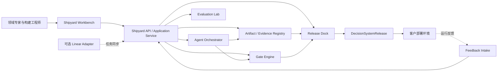

# AI-FDE Shipyard Workbench 设计

日期：2026-08-15  
状态：待用户审阅  
范围：AI-FDE Shipyard 构建与交付平台，不包含客户生产运行时

## 1. 定位

AI-FDE Shipyard 是一套用于构建、评测、发布和升级客户业务决策系统的领域工程平台。

```text
AI-FDE Shipyard
    → 构建 DecisionSystemRelease
    → 部署到客户环境
    → 客户业务决策系统持续运行
```

AI-FDE 是“船坞”，客户业务决策系统是“轮船”。Shipyard 可以在沙箱中运行轮船的仿真副本，但不承担客户生产环境中的持续预测、决策和业务动作执行。

### 1.1 核心目标

让一组人类和 Agent 能够围绕证据、产物和质量门禁，稳定地交付一套可部署、可评测、可回滚和可升级的业务决策系统。

### 1.2 非目标

第一版不包含：

- 客户生产环境的持续预测和决策运行时；
- 客户业务人员的生产操作台；
- Linear 工单作为核心交互界面；
- 通过自然语言评论直接改变系统状态；
- Agent 直接执行客户生产动作；
- 通用低代码应用平台；
- 不受门禁约束的全自动 Ontology 建模。

Linear 可以作为未来的可选任务同步适配器，但不进入第一版核心构建目标。

## 2. 设计原则

### 2.1 产物优先，而不是聊天优先

人类主要评审工程产物，而不是阅读 Agent 对话记录。每次 Agent 运行必须输出结构化提案、证据、变更、验证结果和待解决问题。

### 2.2 Gate 驱动，而不是状态驱动

项目不能因为 Agent 完成了某个步骤就自动进入下一阶段。只有对应 Gate 的验证事实齐全并通过，阶段才可以前进。

### 2.3 AI-FDE 构建平面与客户运行时分离

构建阶段的人类评审用于确认业务语义、系统设计、评测结果和发布版本；客户运行时的人类授权属于交付系统自身的责任域，不能混入 Shipyard 的 Agent 进程。

### 2.4 Agent 只能提案，应用服务才能改状态

Agent 不直接写项目状态、发布状态、审批状态或生产系统。Agent 提交 Proposal，由 Shipyard Application Service 进行权限、版本、Gate 和冲突校验。

### 2.5 所有结论必须可追溯

每个对象、映射、特征、模型、决策和发布包都必须能追溯到数据快照、证据、代码/配置版本、评测运行和人类评审。

### 2.6 先做垂直闭环，再扩展工作台

第一版不建设空泛的“万能工作台”，而是用一个真实领域项目打通：决策定义、Ontology、数据产品、评测、Gate 和 Release 的完整路径。

## 3. 系统边界



### 3.1 Shipyard Workbench

面向领域专家、FDE 工程师、模型工程师和发布负责人，提供：

- 项目工作区；
- 业务决策建模；
- Ontology 审查和编辑；
- 数据产品和血缘审查；
- 模型与优化评测；
- Gate Review；
- Release Dock；
- 上下文 Agent 协作。

### 3.2 Shipyard API / Application Service

负责把界面命令转换为受治理的应用操作。它是 UI、Agent 和领域内核之间的唯一写入边界，负责：

- 输入校验；
- 当前版本和并发检查；
- 人类身份和角色解析；
- Gate 前置条件检查；
- Proposal 接受、拒绝和退回；
- Evaluation Run 创建；
- Release Candidate 创建；
- 审计事件追加。

### 3.3 现有领域内核

复用现有 Python 模块作为领域内核，而不是在前端重复实现业务规则：

- `aifde.builder`：证据驱动构建流程；
- `aifde.ontology`：Ontology IR、计算和形状验证；
- `aifde.ingestion`：数据连接、抽取和质量；
- `aifde.ml`：模型注册和时间评测；
- `aifde.optimization`：决策和优化合同；
- `aifde.gates`：Gate 定义、执行和失效；
- `aifde.release`：发布包、验证和回滚；
- `aifde.agents` / `aifde.orchestration`：Agent 工作区和编排；
- `aifde.registry`：项目、产物、运行和审计持久化。

## 4. 主要工程对象

### 4.1 ProjectWorkspace

代表一个 AI-FDE 构建项目，包含：

- 项目身份和领域包；
- 当前构建阶段；
- 决策案例；
- 输入证据和数据源；
- 产物版本；
- Gate 运行；
- 未解决问题；
- 人类评审；
- Release Candidate。

### 4.2 DecisionCase

描述一个需要被系统化解决的业务决策：

- 决策名称和目标；
- 决策者和使用者；
- 触发场景；
- 输入变量；
- 可选动作；
- 约束和目标函数；
- 业务 KPI；
- 当前基线做法；
- 成功与失败定义。

### 4.3 Artifact

所有构建成果都作为带版本的 Artifact 管理，包括：

- Evidence Snapshot；
- Decision Contract；
- Ontology Candidate；
- Ontology Mapping；
- Data Product；
- Feature Definition；
- Model；
- Optimization Contract；
- Application；
- Agent Definition；
- Evaluation Report；
- Release Manifest。

每个 Artifact 必须包含：

```text
artifact_id
version
content_hash
parent_artifact_ids
evidence_refs
producer
created_at
validation_results
status
```

### 4.4 AgentProposal

Agent 只能提交 Proposal：

```text
proposal_id
task_packet_id
proposed_changes
affected_artifact_ids
evidence_refs
validation_results
confidence
risks
open_questions
next_step
```

Proposal 默认不会改变项目状态，必须经由人类操作或明确的低风险自动策略提交给 Application Service。

### 4.5 GateRun

记录一个质量门禁的实际运行：

- Gate 定义版本；
- 验证器版本；
- 输入 Artifact 哈希；
- 输出结果；
- 失败原因；
- 警告；
- 证据引用；
- 是否已失效。

### 4.6 DecisionSystemRelease

这是 Shipyard 交付给客户的“船体清单”：

```text
release_id
project_id
domain_pack_version
ontology_package
data_product_package
feature_package
model_package
decision_policy_package
application_package
action_adapter_package
evaluation_report
passed_gate_runs
deployment_manifest
migration_plan
rollback_plan
compatibility_contract
release_approvals
```

Release 必须可复现、可验证、可部署和可回滚。

## 5. Workbench 信息架构

### 5.1 Project Home

项目首页回答四个问题：

1. 我们正在构建什么决策系统？
2. 当前处于哪个阶段？
3. 哪些问题阻塞了前进？
4. 最近一次构建产物和评测结果是什么？

首页展示：当前阶段、阻塞 Gate、待处理 Review、最近变更、运行指标和下一步建议。

### 5.2 Decision Canvas

用于业务专家和 FDE 共同定义决策，不允许直接从自然语言描述跳到 Ontology。必须显式确认：

- 谁做决策；
- 在什么场景做决策；
- 使用什么输入；
- 比较什么候选方案；
- 做出决定后采取什么动作；
- 如何判断系统有效。

### 5.3 Ontology Studio

采用“候选—证据—差异—评审”工作流：

- Agent 生成候选对象和关系；
- UI 显示来源证据；
- 人类查看语义差异；
- 接受、拒绝或修改候选；
- 编译器生成 Ontology IR；
- SHACL/语义 Gate 验证；
- 每次修改形成新版本。

### 5.4 Data Product Studio

以数据产品为中心展示：

- 数据源和快照；
- 抽取结果；
- 管道拓扑；
- 质量检查；
- 计算字段；
- 特征定义；
- 数据血缘；
- 时间可用性和泄漏规则。

### 5.5 Evaluation Lab

统一展示：

- 描述性分析；
- 预测模型；
- 决策/优化模型；
- 规则基线；
- 回测；
- 时间切分；
- 仿真；
- 反事实比较；
- 业务 KPI；
- 失败样例。

任何模型或优化结果都必须能回到具体输入快照、特征版本和决策目标。

### 5.6 Gate Review

人类不是阅读 Agent 日志，而是审查 Gate Packet：

```text
Gate 名称
验收标准
输入版本
自动验证结果
关键失败样例
Agent 解释
待人类判断的问题
建议动作
```

人类操作使用结构化命令：通过、退回、要求补证据、修改目标、重新评测。自然语言只作为补充说明，不直接代表状态改变。

### 5.7 Release Dock

Release Dock 对候选发布执行：

- Artifact 完整性检查；
- Gate 新鲜度检查；
- 依赖版本检查；
- 部署前检查；
- 数据迁移检查；
- 回滚检查；
- 客户验收记录；
- 发布包签名和导出。

## 6. Agent 协作协议

### 6.1 Task Packet

Workbench 为 Agent 生成受限任务包：

```text
task_packet_id
workspace_id
stage_id
objective
allowed_artifact_kinds
input_artifact_ids
input_evidence_refs
acceptance_criteria
budget
deadline
```

Agent 只能读取任务包允许的输入，并只能提交允许类型的 Proposal。

### 6.2 Agent 工作循环

```text
领取 Task Packet
→ 读取证据和版本
→ 分析/生成候选
→ 自检和挑战
→ 提交 Proposal
→ 等待 Gate 或人类 Review
→ 根据结构化反馈修改
→ 产生新版本
```

### 6.3 Agent 禁止事项

- 直接修改 Artifact Registry；
- 直接改变 Gate 状态；
- 自行批准 Proposal；
- 自行创建 Release；
- 直接调用客户生产 Action；
- 把普通文本伪装成 Review 事实；
- 使用未声明的输入证据；
- 隐藏失败、冲突或低置信度结果。

## 7. 构建生命周期与质量门禁

```text
INTAKE
  → DECISION_DEFINED
  → EVIDENCE_CAPTURED
  → ONTOLOGY_DESIGNED
  → DATA_PRODUCT_BUILT
  → INTELLIGENCE_BUILT
  → WORKFLOW_BUILT
  → EVALUATED
  → RELEASE_REVIEW
  → RELEASE_CANDIDATE
  → DELIVERED
```

对应 Gate：

- G0：业务目标和决策契约；
- G1：证据完整性和来源可信度；
- G2：Ontology 语义、结构和权限；
- G3：数据产品质量、血缘和时间正确性；
- G4：分析、预测和优化效果；
- G5：应用和工作流可用性；
- G6：安全、审计和可操作性；
- G7：Release 完整性、部署和回滚。

Gate 失败不会被 Agent 自动覆盖。失败必须生成结构化 FailureFact，并进入 Review 或修复任务。

## 8. 推荐技术实现

### 8.1 前端

- React + TypeScript；
- Vite；
- TanStack Query 管理服务端状态；
- React Flow 或等价图形组件展示 Ontology 和管道；
- Monaco 或等价差异编辑器展示配置和产物 diff；
- 前端只通过 Shipyard API 访问后端。

### 8.2 后端

- FastAPI；
- Pydantic 领域合同；
- 现有 Python 构建内核；
- Application Service 作为唯一写入边界；
- OpenAPI 作为前后端合同；
- SQLite 用于本地开发，PostgreSQL 用于生产部署；
- 对象存储保存大型证据和评测产物。

### 8.3 持久化分层

```text
Metadata Store
  项目、版本、Gate、Review、运行状态

Artifact Store
  Ontology、数据产品、模型、评测报告、发布包

Evidence Store
  原始快照、文档片段、数据血缘和来源

Audit Store
  人类命令、Agent 提案、Gate 结果、发布和回滚事件
```

### 8.4 身份与权限

Workbench 的人类身份由 API 边界的认证上下文提供，不由请求体的 `actor` 字段声明。Agent 不拥有 HUMAN authority，也不在 Agent 进程内模拟客户生产授权。

本地开发可以使用明确标记的 FakeAuth，但 FakeAuth 不得进入生产配置和生产测试路径。

## 9. 端到端 API 方向

第一版 API 以工作区和产物为中心：

```text
GET  /workspaces
POST /workspaces
GET  /workspaces/{id}/overview
GET  /workspaces/{id}/decision-cases
POST /workspaces/{id}/decision-cases
GET  /workspaces/{id}/artifacts
GET  /artifacts/{id}/diff
POST /artifacts/{id}/proposals
POST /proposals/{id}/accept
POST /proposals/{id}/reject
POST /proposals/{id}/request-changes
GET  /workspaces/{id}/gates
POST /gates/{id}/runs
POST /gates/{id}/review
POST /workspaces/{id}/evaluations
POST /workspaces/{id}/release-candidates
POST /release-candidates/{id}/verify
POST /release-candidates/{id}/export
```

Agent API 与人类 API 分离。Agent API 只能提交 Task Result 和 Proposal，人类 API 才能提交 Review、Gate Decision 和 Release Decision。

## 10. 第一条垂直切片

使用现有 `software_delivery` 领域作为第一条 Workbench 垂直切片：

```text
软件需求对齐与追加问题
→ 需求决策契约
→ 需求/人员/任务 Ontology
→ 数据产品和特征
→ 工期预测
→ 需求变更影响分析
→ 评测和 Release Candidate
```

第一条切片必须能在 Workbench 中完整完成：

1. 创建项目工作区；
2. 定义一个业务决策案例；
3. 导入证据和数据源；
4. 生成并审查 Ontology 候选；
5. 查看数据产品和特征；
6. 运行预测评测；
7. 处理 Gate Review；
8. 导出 `DecisionSystemRelease`。

## 11. 分阶段交付

### Phase 0：合同和工作区骨架

- ProjectWorkspace、Artifact、Evidence、Gate、Review 的 API 合同；
- 前后端 OpenAPI 合同；
- 从现有 read-only cockpit 迁移为工作区首页；
- 不接入复杂 Agent 对话。

### Phase 1：Artifact Review

- Artifact 列表和版本；
- Diff；
- Evidence 引用；
- Proposal 展示；
- 接受/拒绝/要求修改。

### Phase 2：Gate Review

- Gate Packet；
- 自动验证结果；
- 人类结构化评审；
- Gate 失效和重跑；
- 审计事件。

### Phase 3：Ontology/Data/Evaluation 工作区

- Ontology 图和语义差异；
- 数据管道和血缘；
- 特征和时间窗口；
- 模型、优化和回测结果。

### Phase 4：Contextual Agent

- 基于当前页面和选中 Artifact 的 Agent；
- Task Packet；
- Proposal；
- 证据绑定；
- 结构化反馈循环。

### Phase 5：Release Dock

- Release Candidate；
- 完整性验证；
- 部署 manifest；
- 回滚 manifest；
- DecisionSystemRelease 导出。

Linear Adapter、客户生产运行时和复杂多租户能力放在后续版本。

## 12. 验收标准

Shipyard Workbench 第一版只有满足以下条件才算完成：

- 人类可以不依赖 Linear 完成一条完整构建流程；
- Agent 不能直接改变 Artifact、Gate 或 Release 状态；
- 每个 Proposal 都能查看证据、输入版本和变更差异；
- Gate 失败能够阻断阶段推进；
- 评测结果能追溯到数据、特征和模型版本；
- Release Candidate 能生成可验证的 DecisionSystemRelease；
- 构建流程可在测试项目中重放；
- 人类身份由 API 认证上下文提供，不由 Agent 或请求体自报；
- 现有领域内核测试和新 Workbench 合同测试全部通过；
- 交付包包含部署、迁移、回滚和验收信息。

## 13. 成功指标

不以页面数量或 Agent 数量衡量，而以建船能力衡量：

- 从业务目标到 Release Candidate 的周期；
- 人类在每个 Gate 的平均审查时间；
- Proposal 一次通过率；
- Gate 失败的可解释率；
- 产物和证据的完整追溯率；
- 评测结果与客户验收结果的一致性；
- Release 回滚成功率；
- 同一构建模板复制到新项目的时间；
- 客户运行反馈进入下一版本的周期。

## 14. 当前设计决策

本设计明确采用：

- Shipyard Workbench 作为核心人机协作界面；
- React/TypeScript + FastAPI；
- Artifact-first、Gate-driven；
- Agent Proposal 而不是 Agent 直接写状态；
- 现有 Python 构建内核复用；
- Linear 作为未来可选适配器；
- 客户运行时与 AI-FDE Shipyard 分离；
- 第一条垂直切片使用软件开发需求对齐和工期预测。

