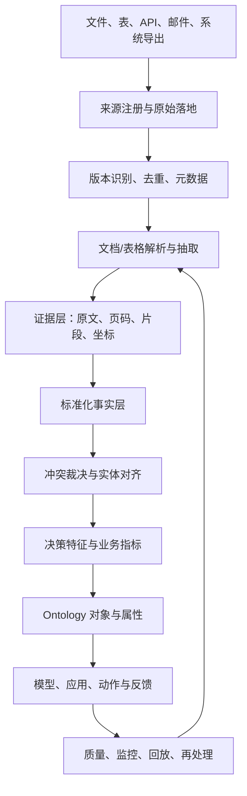

# 数据产品与散乱资料管道方法论

## 1. 为什么数据产品是核心工程节点

Ontology、模型和 Agent 的质量上限受数据产品约束。

如果数据只是松散文件、重复表格、互相矛盾的文档和没有稳定时间语义的记录，那么：

- Ontology 只能变成不可靠的业务目录；
- 模型会学到错误关联；
- LLM 会从多个冲突来源中拼出貌似合理的答案；
- 用户无法追溯事实来源；
- 预测模型无法构造无泄漏的训练样本。

数据产品的目标不是把所有资料“集中起来”，而是把特定业务决策所需的数据，生产成稳定、可追溯、可验证、可复用、可持续更新的资产。

## 2. 数据产品生产契约

每个数据产品在开发前必须填写：

```text
产品名称：
服务的业务决策：
使用者：
业务粒度：
主键：
事件时间：
有效时间：
观察时间：
刷新频率：
历史保留：
来源系统：
来源文件/表/接口：
来源优先级：
字段定义：
质量规则：
权限和敏感数据：
血缘要求：
下游 Ontology 对象：
下游模型/应用/动作：
新鲜度 SLO：
失败处理：
回放/补数方式：
产品 Owner：
维护 Owner：
```

没有这份契约，不应直接开始写抽取代码或建 Ontology。

## 3. 总体架构



核心设计是保留中间层，而不是直接把抽取结果写进 Ontology：

```text
原始资料层
→ 解析结果层
→ 证据层
→ 标准化事实层
→ 决策特征层
→ Ontology 投影层
```

## 4. 阶段一：资料盘点和来源注册

### 4.1 建立来源目录

每个文件或表至少记录：

- 文件路径或 URI；
- 文件名；
- 文件类型；
- 创建时间；
- 修改时间；
- 版本号；
- 所属组织；
- 业务 Owner；
- 来源系统；
- 适用时间范围；
- 可信级别；
- 敏感级别；
- 是否为正式版本；
- 是否允许进入模型；
- 是否允许外发给 LLM。

### 4.2 不要按照文件夹直接建 Ontology

文件夹结构通常反映组织习惯，不一定反映业务实体。应先建立来源目录和内容目录，再识别业务概念。

### 4.3 内容分类

至少分为：

- 结构化表格；
- 半结构化 Excel；
- 电子 PDF；
- 扫描 PDF；
- Word/HTML；
- 邮件和聊天导出；
- 图片和图纸；
- 合同、订单、报告、手册、通知和变更单。

不同类别不能使用同一套抽取逻辑。

## 5. 阶段二：原始资料落地

### 原则

原始资料必须保留，不能只保留 LLM 抽取后的结果。

原始层用于：

- 重新抽取；
- 解释冲突；
- 审计；
- 评估新模型；
- 处理规则变化；
- 复现历史版本。

Palantir 的 Media Sets 用于管理高规模的非结构化数据，包括文档、图片、音频、视频和电子邮件；媒体可以通过媒体引用与表格和 Ontology 对象关联。[Media Sets](https://www.palantir.com/docs/foundry/data-integration/media-sets)

## 6. 阶段三：文件去重和版本识别

### 6.1 技术去重

计算：

- 文件哈希；
- 页面哈希；
- 文本规范化哈希；
- 表格行/列指纹；
- 业务键组合。

### 6.2 业务去重

不同文件可能内容相同但文件名不同，因此还要比较：

- 合同编号；
- 订单号；
- 供应商编号；
- 设备编号；
- 版本号；
- 生效日期；
- 发布部门；
- 签署状态。

### 6.3 版本策略

不要简单使用“最后修改时间”作为正式版本。优先顺序应由业务定义，例如：

```text
已签署版本 > 已批准版本 > 正式发布版本 > 草稿版本
```

如果两个正式来源冲突，必须产生冲突记录，不能静默覆盖。

## 7. 阶段四：文档抽取流水线

### 7.1 先建立黄金样本集

从每类文件中选择代表性样本：

- 简单文本；
- 多栏排版；
- 复杂表格；
- 扫描件；
- 页眉页脚干扰；
- 图文混排；
- 多语言；
- 版本差异；
- 异常和损坏文件。

每个样本人工标注期望结果，形成评估集。

### 7.2 选择抽取策略

根据文档类型在以下策略中选择：

- 原始文本提取；
- 传统 OCR；
- 布局感知 OCR；
- VLM 文档抽取；
- OCR 预处理后再交给 VLM；
- 自定义 prompt 和结构化 schema。

AIP Document Intelligence 支持在媒体集上测试不同抽取策略，并比较质量、速度和 token 成本；确认策略后可以生成 Python transform，对整个媒体集批量处理。[AIP Document Intelligence](https://www.palantir.com/docs/foundry/document-intelligence/overview)

### 7.3 输出必须包含证据

抽取结果不能只有：

```json
{"promised_date": "2026-08-20"}
```

还应尽量包含：

```json
{
  "value": "2026-08-20",
  "source_document_id": "doc-123",
  "source_version": "v4",
  "page_number": 7,
  "text_span": "承诺交付日期：2026-08-20",
  "bounding_box": [0.12, 0.44, 0.58, 0.49],
  "extraction_strategy_version": "layout-vlm-03",
  "review_status": "unreviewed"
}
```

证据层使用户能够从 Ontology 属性跳回原始文档和原文位置。

### 7.4 结构化输出和人工复核

对关键字段采用：

- JSON schema；
- 类型校验；
- 日期和单位规范化；
- 值域校验；
- 必填校验；
- 低置信度进入人工复核；
- 高风险字段必须人工批准。

### 7.5 部署为生产管道

先在样本集上验证，再生成 Python transform；不要直接把调试 prompt 粘到生产代码中。官方文档建议在 Document Intelligence 中调整并验证配置后重新部署，避免应用配置与批处理代码不一致。[部署文档抽取](https://www.palantir.com/docs/foundry/document-intelligence/deploy-to-python-transforms)

## 8. 阶段五：标准化事实层

抽取结果不应直接成为 Ontology 属性。先形成规范化事实：

```text
事实名称：promised_delivery_date
主体：purchase_order_line_123
值：2026-08-20
单位：date
有效时间：2026-08-20
观察时间：2026-08-10 12:00
来源：doc-123 page 7
版本：v4
可信级别：approved
冲突状态：none
```

这一层负责：

- 日期规范化；
- 单位转换；
- 供应商名称对齐；
- 订单号清洗；
- 语言和缩写统一；
- 缺失和未知区分；
- 文档事实和系统事实对齐。

## 9. 阶段六：重复、冲突和来源裁决

### 9.1 实体对齐

为供应商、订单、产品、地点等实体建立稳定 ID：

```text
canonical_supplier_id
source_system
source_supplier_id
supplier_name_raw
supplier_name_normalized
matching_method
matching_confidence
```

禁止只靠名称字符串直接合并。

### 9.2 事实优先级

每个事实类型定义来源优先级，例如：

```text
已批准 ERP 订单
> 已签署合同
> 供应商确认邮件
> 运营人员手工备注
> 自动抽取但未复核文档
```

这不是通用常数，必须由领域 Owner 确认。

### 9.3 冲突处理

当两个来源产生不同承诺日期时，系统必须生成：

```text
conflict_id
entity_id
fact_type
candidate_values
source_evidence
precedence_rule
resolution_status
resolver
resolution_time
```

可能的处理结果：

- 自动选择高优先级来源；
- 保留多个有效版本；
- 进入人工审核；
- 暂不进入模型；
- 进入风险事件。

### 9.4 不能静默覆盖

如果冲突被隐藏，模型会把错误的标准化结果当成事实，用户也无法知道系统为什么这样判断。

## 10. 阶段七：时间语义和增量生产

### 必须保存的时间

- `event_time`：事情发生时间；
- `valid_from/valid_to`：事实有效区间；
- `observed_at`：平台观察时间；
- `document_version_time`：文档版本时间；
- `as_of_time`：用于预测和决策的截点。

### 增量处理规则

新文件：只处理新增文件；

文件修订：重新处理受影响的页面和事实；

抽取策略变更：按策略版本重跑；

实体匹配规则变更：重新计算受影响实体；

标签规则变更：重新生成训练样本；

模型版本变更：保留旧评分，生成新评分并进行比较。

官方文档支持将文档抽取部署为增量 Python transform，新文件可以只处理新增文档；对于失败项，也可以单独筛选并重新运行。[增量文档抽取](https://www.palantir.com/docs/foundry/document-intelligence/deploy-to-python-transforms)

## 11. 阶段八：数据质量和健康监控

### 结构质量

- schema 是否变化；
- 字段类型是否稳定；
- 主键是否唯一；
- 日期是否可解析；
- 单位是否统一；
- 文档是否完整；
- 页码是否连续。

### 业务质量

- 订单是否有供应商；
- 交付日期是否晚于下单日期；
- 收货数量是否超过订购数量；
- 运输事件是否有时间顺序；
- 供应商是否存在于主数据；
- 事实是否有来源证据。

### 抽取质量

- 字段准确率；
- 表格行列恢复率；
- 证据定位成功率；
- 结构化输出通过率；
- 人工复核率；
- 失败文档比例。

### 预测质量

- 训练样本覆盖；
- 标签延迟；
- 特征缺失率；
- 时间泄漏；
- 线上分布漂移；
- 预测结果可解释性。

数据期望应在管道中以代码定义，失败时阻断下游构建或进入告警和失败队列。[Data Expectations](https://www.palantir.com/docs/zh/foundry/maintaining-pipelines/define-data-expectations)

## 12. 阶段九：投影到 Ontology

只有通过标准化、质量和权限检查的数据，才能映射成 Ontology 对象属性。

映射至少记录：

```text
Ontology object type：
Ontology property：
Backing datasource：
Source fact：
Transformation：
Refresh：
Time semantics：
Permission：
Evidence link：
Owner：
```

预测结果和抽取事实最好区分：

```text
PurchaseOrder.promised_delivery_date       # 事实
PurchaseOrder.predicted_delay_probability  # 预测
PurchaseOrder.delay_risk_level             # 决策分层
PurchaseOrder.delay_evidence               # 证据
DelayRisk                                   # 运营事件
```

## 13. 供应商延误数据产品模板

### 事实实体

```text
Supplier
PurchaseOrder
PurchaseOrderLine
Shipment
Receipt
SupplierCommitment
SupplierCommunication
```

### 关键事件

```text
order_created
order_confirmed
promise_changed
production_started
shipment_created
shipment_delayed
customs_hold
goods_received
order_cancelled
```

### 数据产品层

```text
supplier_master_product
order_lifecycle_product
shipment_event_product
supplier_performance_product
delay_training_example_product
delay_scoring_product
delay_risk_event_product
```

### 预测样本

```text
entity_id = purchase_order_line_id
as_of_time = 2026-08-10 06:00
feature_snapshot = all information observed by as_of_time
label = actual_delivery > promised_delivery + 3 days
label_observed_time = actual_receipt_time
```

### 业务输出

```text
delay_probability
expected_delay_days
expected_cost
top_reason_codes
evidence_references
recommended_actions
```

## 14. AI 在数据产品中的正确使用方式

AI 可以加速：

- 文件分类；
- 字段候选识别；
- 结构抽取；
- 供应商/订单实体匹配候选；
- 数据字典生成；
- 质量规则草拟；
- 管道代码草拟；
- 异常解释；
- 文档变更摘要。

AI 不应未经控制地决定：

- 哪个来源是真实来源；
- 哪个日期覆盖另一个日期；
- 哪个实体可以合并；
- 哪条敏感信息可以外发；
- 哪个预测直接触发高风险动作。

这些决策必须有来源优先级、领域 Owner、权限、人工确认和审计。

## 15. 数据产品交付验收

### 硬门槛

- 主键稳定且唯一；
- 粒度明确；
- 时间语义完整；
- 来源和证据可追溯；
- 重复和冲突有规则；
- 敏感数据有权限；
- 质量检查可自动运行；
- 失败可定位和重试；
- 变化可增量处理或可回放；
- 下游模型没有未来信息泄漏。

### 软门槛

- 字段命名统一；
- 文档完整；
- 常用查询性能可接受；
- 抽取策略成本可接受；
- 人工复核比例逐步下降；
- 供应商和订单覆盖范围足够。

### 不合格信号

- “所有文件都已导入”但无法说明哪些内容被采用；
- “模型准确率不错”但没有时间切分；
- “Ontology 已建好”但没有预测标签和动作；
- “LLM 已提取”但没有原文证据；
- “数据冲突已处理”但没有裁决记录；
- “数据每天更新”但没有延迟和失败告警。
